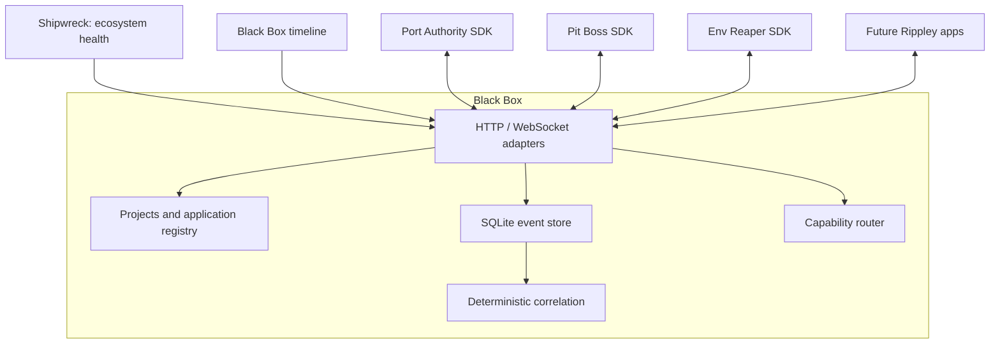

# Architecture

## Independent applications, shared contracts

Black Box is the transport and historical record. Port Authority owns processes and ports, Pit Boss owns task execution, and Env Reaper owns environment checks. Each integration imports the protocol and SDK, advertises its capabilities, and publishes facts. Providers retain control over which requests they execute. The daemon never imports or invokes a sibling application's implementation.

## Protocol and delivery

Every event has a versioned envelope, UUID, producer timestamp, source app, dot-delimited type, severity, message, tags, and metadata. Project identity, correlation/parent IDs, payload, and actions are optional. Validation rejects unsupported schema versions and malformed input. The daemon assigns a monotonically increasing sequence used for replay; producer time remains available for forensic ordering.

Events are immutable facts. Duplicate UUIDs do not add duplicate history. Clients may retry deliveries, so this is at-least-once transport with idempotent storage, not a promise of global exactly-once execution. A bounded SDK queue tolerates a recorder outage without preventing the host from working. Its buffer lives in memory; host shutdown or queue expiry can lose undelivered events.

WebSocket streams select event patterns and resume from a sequence cursor. Replay and live events use the same schema. Slow connections are bounded by server backpressure rather than allowing unlimited memory growth. Subscription handlers must not assume replay is a new occurrence; downstream side effects should be idempotent by event ID.

## Project identity

A project record owns a stable ID, display name, paths, Git repository, remote URL, domains, environments, commands, process IDs, associated apps, and explicit aliases. Register all known identities at integration time. Repository aliases normalize GitHub HTTPS and SSH remotes. Two unrelated repositories with the same basename must not be silently combined. Ambiguous identity needs an explicit stable project ID.

Application-local paths and repository references are observations, not permission to open files or run commands. Updating a registry entry does not mutate a repository or start its processes.

## Correlation and explanation

Explicit correlation IDs and parent references are the strongest evidence. Automatic grouping uses project identity, time proximity, and shared process, port, command, deployment, or repository context. Correlation identifies related activity, not proven causation. An explanation names the observed warning/error sequence and presents a likely cause only where evidence supports it. It does not send data to an AI provider.

Saved incidents capture a group of event IDs, sources, times, and explanation, with open/resolved status. Resolving an incident is bookkeeping; it does not repair or restart the project.

## Commands and request/response

Providers advertise capability names and connect a command channel. A request selects a provider explicitly or resolves an unambiguous connected provider. The router records a command ID, correlation ID, payload, deadline, acknowledgement, and final result. A provider acknowledges acceptance then completion/failure. Timeouts are terminal recorded outcomes; they do not cancel a handler that has already started. Providers must own cancellation and resource limits. Event replay must never replay executable command messages.

The protocol supports suggested actions that point to a capability plus a payload. Confirmation-required capabilities reject requests without confirmation; dashboard controls ask before submitting. Provider handlers still own validation and permissions. No incoming string is interpreted as a shell program by the daemon.

## Storage and lifecycle

SQLite persists events, projects, applications, capabilities, actions, incidents, correlations, commands, and retention settings. WAL mode supports the local read-heavy dashboard while ingesting events. Indexed envelope fields and sequence cursors support bounded history queries; cleanup follows per-severity retention. JSONL export supplies a portable archive. Large multi-machine ingestion and automated archive tiering are outside this local MVP.

Heartbeats describe application liveness; an app becomes disconnected when its heartbeat expires. Recorded events remain queryable after it disconnects. The latest observations drive project summaries, so silence should not be interpreted as verified process health.

## Security and extension points

Redaction runs at ingress, before storage and broadcast, and on SDK event buffering. Error responses must not echo raw secrets. The daemon is loopback-only, checks HTTP hosts and browser origins, restricts request sizes, and does not expose filesystem reads through its API. Imported logs are uploaded by the user or read by the explicit local CLI.

The HTTP/WebSocket client sits behind an SDK transport interface. A future socket or named-pipe adapter can implement that interface without changing event producers. BYOK analysis can consume the existing context result as an optional module. Shipwreck uses aggregate health; a future House Edge adapter must consume only explicit aggregates and remain opt-in. No remote integration is active in this version.

Implementation references: [better-sqlite3 API](https://github.com/WiseLibs/better-sqlite3/blob/master/docs/api.md), [ws server/client documentation](https://github.com/websockets/ws/blob/master/README.md).
